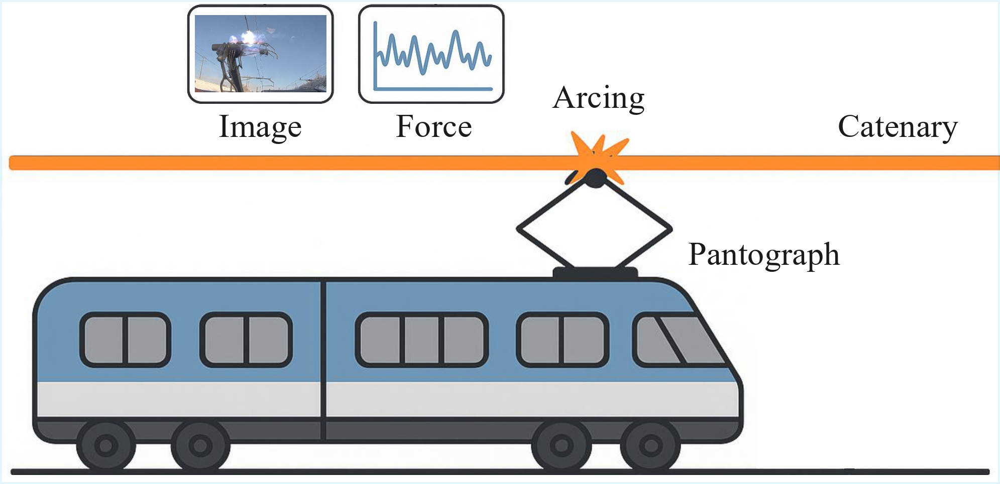

<div align="center">

<h1>Multimodal Learning for Arcing Detection in Pantograph-Catenary Systems</h1>

<div>
    <a href='https://sites.google.com/view/dong-hao/' target='_blank'>Hao Dong</a><sup>1</sup>&emsp;
    <a href='https://chatzi.ibk.ethz.ch/about-us/people/prof-dr-eleni-chatzi.html' target='_blank'>Eleni Chatzi</a><sup>1</sup>&emsp;
    <a href='https://people.epfl.ch/olga.fink?lang=en' target='_blank'>Olga Fink</a><sup>2</sup>
</div>
<div>
    <sup>1</sup>ETH Zurich, <sup>2</sup>EPFL
</div>


<div>
    <h4 align="center">
        • <a href="https://arxiv.org/abs/2602.08792" target='_blank'>arXiv 2026</a> •
    </h4>
</div>


<div style="text-align:center">

</div>

---

</div>

Proposed solution for arcing detection in pantograph-catenary systems with image and force measurements.


## Citation
The code and dataset will be available soon.

## Citation
If you find our work useful in your research please consider citing our [paper](https://arxiv.org/abs/2602.08792):

```
@article{dong2026arcing,
    title={Multimodal Learning for Arcing Detection in Pantograph-Catenary Systems},
    author={Dong, Hao and Chatzi, Eleni and Fink, Olga},
    journal={arXiv preprint arXiv:2602.08792},
    year={2026}
}
```
